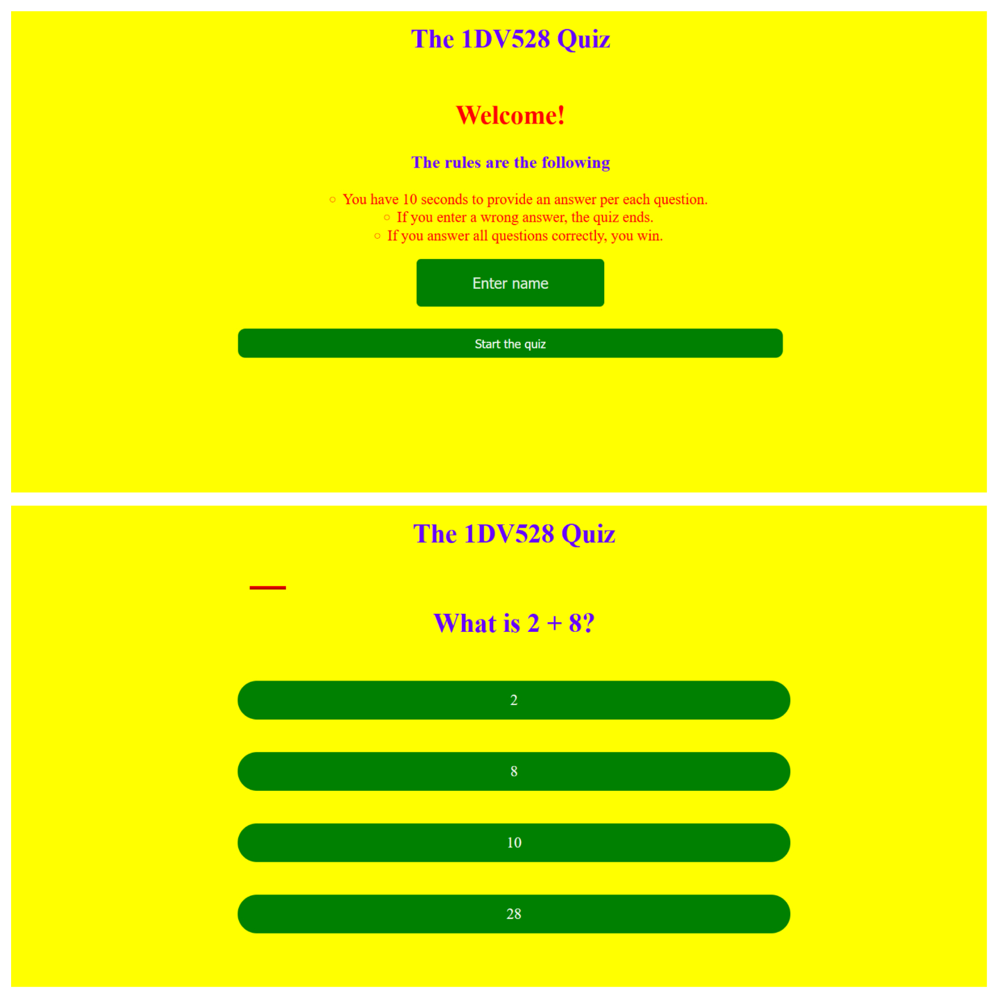

# A2 Quiz

## Author: Fabian Dacic

### Introduction 

Hello and welcome to the 1DV528 quiz application.
The application is quite intuitive in the sense that 
the design is quite simplistic and the easy to follow. 
My solution begins by having a starting page which requires the user to enter their name and a button which is required to start the application itself. Once the button or key 'Enter' has been pressed, the application begins by fetching the question from the link that was provided for us in the guide. Based on the type of question it is, the question is represented accoridingly i.e if it is a 'regular' question then only an input box will be shown whereas if it's an alternative-based question, radio buttons will be shown instead. The application waits for the user's answer for 10 seconds and once that time runs out or the user answers wrong, the game ends. Otherwise, it continues on until there are no more questions or the user enters a special answer (hint: The answer to the ultimate question of life, the universe, and everything).

Now to download the game, it is actually quite easy. Clone it by using the following commands in Git Bash: 

```
git clone [this repo's link]
```

After downloading or cloning the repository to your machine, simply open the application with an IDE of your choice and then run the following command in the terminal: 

```
npm run serve
```
After having run said command in the terminal, click on the link shown on it and the application should begin.

The rules of the game are quite intuitive: the player has 10 seconds to answer per each question, the player must type or select an answer in order to progress, once the player has either won or lost they will be greeted by an appropriate page based on the status.

In order to run the linters that were provided alongside the basis of the application, simply run the following command on the terminal while the current workign directory is set to the quiz's repository: 

```
npm run lint
```
After having run the command above, the linter errors will be presented in case there are any. There also linter extensions for various IDEs (Visual Studio Code) that provide somewhat similar functions. 
